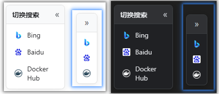
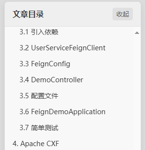

# 油猴脚本

### 搜索引擎快速切换工具栏.js
- 支持跟随系统切换 `浅色` `深色` UI
- 支持拖拽、收缩/展开

  

### 芋道文档系列

1. 芋道文档强制浅色&护眼模式.js
  
    > 为芋道文档开启强制浅色模式，并提供护眼功能。

2. 芋道文档VIP解锁.js
    > 解锁芋道文档的VIP内容。

3. 芋道文档文章悬浮目录.js
    > 为芋道文档的文章页增加悬浮目录，方便快速跳转。

   

### V2EX Hide All Images.js
- 隐藏 V2EX 网站的所有图片。